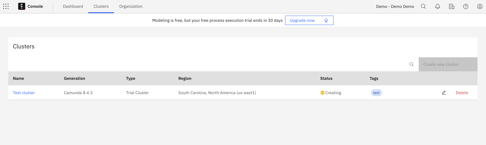

# Get started with Camunda 8

This repository gets users started with [Camunda 8](https://camunda.com/platform/) and contains instructions on how to:

- Model your first process
- Create a user task form
- Automate a service task

During this guide, you will use Console, Modeler, Zeebe, Operate, and Tasklist.

To leverage your process data and analyze areas for improvement, [get started with Optimize](https://docs.camunda.io/docs/next/components/optimize/improve-processes-with-optimize/).

# Repository structure

The repository contains the following folders:

- [_csharp_](csharp/) - C# example to model, create, and automate your process.
- [_go_](go/) - Go example to model, create, and automate your process.
- [_images_](images/) - Contains screenshots and images for the guide.
- [_java_](java/) - Plain Java example to model, create, and automate your process.
- [_nodejs_](nodejs/) - Node.js example to model, create, and automate your process.
- [_process_](process/) - Contains the BPMN process and the user task form.
- [_spring_](spring/) - Spring Boot example to model, create, and automate your process.

# Configure your environment

To follow this guide, you first need a running Camunda 8 cluster. For this purpose,
use the Camunda 8 SaaS offering at [https://camunda.io](https://camunda.io).

If you prefer a local developer setup where you can run the getting started guide against a locally-hosted instance, follow the [Camunda 8 deployment guide](https://docs.camunda.io/docs/next/self-managed/deployment/).

To set up your environment using the SaaS offering, take the following steps:

1. [Sign up and log in](https://docs.camunda.io/docs/components/saas/) at [https://camunda.io](https://camunda.io).
2. [Create a new cluster](https://docs.camunda.io/docs/components/console/manage-clusters/create-cluster/) with the latest stable version of Zeebe and the name **Test cluster**.



3. After the cluster is available, [create client credentials](https://docs.camunda.io/docs/components/console/manage-clusters/manage-api-clients/). To do this:
   1. From Console, navigate to the **Clusters** detail page.
   2. Click on your cluster and switch to the **API** tab.
   3. Click **Create new client** and name your client accordingly.

**NOTE: Ensure you keep the generated client credentials in a safe place. The client secret will not be shown again. For your convenience, you can also download the client information to your computer.**

# Model the process

In this example, we'll model a process to send an email message.

Camunda 8 allows you to use the [BPMN](https://docs.camunda.io/docs/components/modeler/bpmn/bpmn-primer/) standard to model your business processes. The process consists of two
tasks: a [user task](https://docs.camunda.io/docs/next/guides/orchestrate-human-tasks/) to allow a human to enter the message content, and a [service task](https://docs.camunda.io/docs/8.6/guides/orchestrate-microservices/) to automatically send the email message.


**NOTE: To keep the scope of this guide limited, this guide only steps through the framework for this process automation example and will not actually send an email. If you would like to send an email, you may extend the example and [connect to a mail provider](https://docs.camunda.io/docs/components/connectors/use-connectors/configuring-out-of-the-box-connectors/).**

To create the process, use [Modeler](https://docs.camunda.io/docs/components/modeler/about-modeler/).

Find the finished process at [process/send-email.bpmn](process/send-email.bpmn), and learn more about [designing a process using BPMN](https://docs.camunda.io/docs/components/modeler/bpmn/automating-a-process-using-bpmn/).

## Model and configure the user task form

To help users complete the user task **Enter message**, [create a user
task form using Modeler](https://docs.camunda.io/docs/components/modeler/forms/utilizing-forms/).

Find the finished form at [process/enter-email-message.form](process/enter-email-message.form)

If you already uploaded the aforementioned BPMN file, this contains the form and process model and requires no additional form configuration.

If you did not previously upload the BPMN file, copy the JSON content of the form into the **Form JSON configuration** field under the **Form** tab in the Modeler properties panel.


## Configure a service task

The last step is defining the job type of the service task.

The job type is
needed for a [job worker](https://docs.camunda.io/docs/components/concepts/job-workers/) to subscribe to the jobs of the task and
complete them.


# Deploy process

Deploy the process using [Web
Modeler](#deploy-using-web-modeler), [Desktop Modeler](#deploy-using-desktop-modeler), [zbctl](#deploy-using-zbctl), or your [own code](#deploy-using-code).

## Deploy using Web Modeler

To deploy the process using Web Modeler, click **Deploy** in the upper right corner of the modeling screen. See [deploy a process](https://docs.camunda.io/docs/components/modeler/web-modeler/run-or-publish-your-process/#deploy-a-process) for additional details.

## Deploy using Desktop Modeler

To deploy the process using Desktop Modeler,
[follow the steps in the Desktop Modeler documentation](https://docs.camunda.io/docs/components/modeler/desktop-modeler/connect-to-camunda-8/).

## Deploy using zbctl

To the deploy the process using `zbctl`, run the
following command after inserting your cluster id and client credentials:

```bash
zbctl deploy resource send-email.bpmn \
  --address 365eed98-16c1-4096-bb57-eb8828ed131e.zeebe.camunda.io:443 \
  --clientId 'GZVO3ALYy~qCcD3MYq~sf0GIszNzLE_z' \
  --clientSecret '.RPbZc6q0d6uzRbB4LW.B8lCpsxbBEpmBX0AHQGzINf3.KK9RkzZW1aDaZ-7WYNJ'
```

## Deploy using code

Writing your own code allows you to deploy the process (for example, on application
startup) to ensure the latest version is deployed. To see examples of
this, visit the [programming language folders](#repository-structure).

# Start process instance

Start a new instance of the process using [Web Modeler](#start-instance-using-web-modeler), [Desktop Modeler](#start-instance-using-desktop-modeler), [zbctl](#start-instance-using-zbctl), or your [own code](#start-instance-using-code).

## Start instance using Web Modeler

To start an instance of the process using Web Modeler, click **Run** in the top right corner of the modeling screen. See [run or publish your process](https://docs.camunda.io/docs/components/modeler/web-modeler/run-or-publish-your-process/) for additional details.

## Start instance using Desktop Modeler

After the process is deployed, click **Start Current Diagram** to start an instance of the process with Desktop Modeler.

## Start instance using zbctl

To start a process instance of the BPMN process id `send-email` using `zbctl`, insert your cluster id and client credentials, and run the following command:

```bash
zbctl create instance send-email \
  --address 365eed98-16c1-4096-bb57-eb8828ed131e.zeebe.camunda.io:443 \
  --clientId 'GZVO3ALYy~qCcD3MYq~sf0GIszNzLE_z' \
  --clientSecret '.RPbZc6q0d6uzRbB4LW.B8lCpsxbBEpmBX0AHQGzINf3.KK9RkzZW1aDaZ-7WYNJ'
```

## Start instance using code

Writing your own code allows you to start an instance of the process on an
external trigger, like an incoming message or a user request. To see examples of this,
visit the [programming language folders](#repository-structure).

# Complete the user task

The first task of the process is the [user task](https://docs.camunda.io/docs/components/modeler/bpmn/user-tasks/)
**Enter message**.


To complete the user task, take the following steps where we will use [Tasklist](https://docs.camunda.io/docs/components/tasklist/introduction-to-tasklist/):

1. Navigate to Tasklist by clicking the square-shaped **Camunda components** icon in the top left corner. Click **Tasklist**.
2. On the **Tasks** page, change the **Filter options** to **All open**.
3. Select the **Enter message** task from the list of tasks, and click **Assign to me**.
4. Fill out the **E-Mail Content** field with the message you want to send.


5. Select **Complete Task**. This will now show up under the **Filter option** that is **Completed**.

# Complete the service task

The second task of the process is the [service task](https://docs.camunda.io/docs/components/modeler/bpmn/service-tasks/)
**Send email**.


To complete the service task, we need to implement the business logic. Therefore, we must create a [job worker](https://docs.camunda.io/docs/components/concepts/job-workers/) for
the task type we defined in the diagram. The job worker will subscribe to all
jobs with the same task type.

To define the task type, we select the service task in the diagram and use
the properties panel to set the task type to `email`.

To implement the logic, we implement a job worker. Check out the
[programming language folders](#repository-structure) to find the job
worker implementations.

# Further references

Find more information in the [Camunda 8 documentation](https://docs.camunda.io), or join the [Camunda 8
Forum](https://forum.camunda.io).
